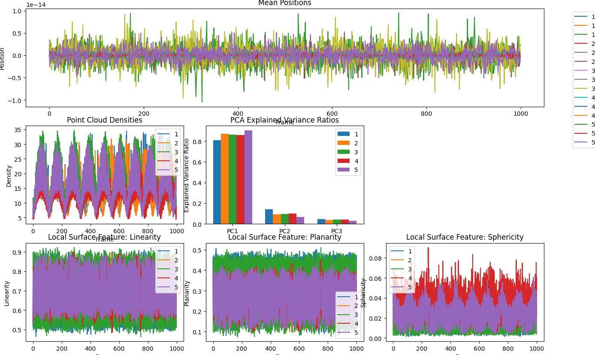
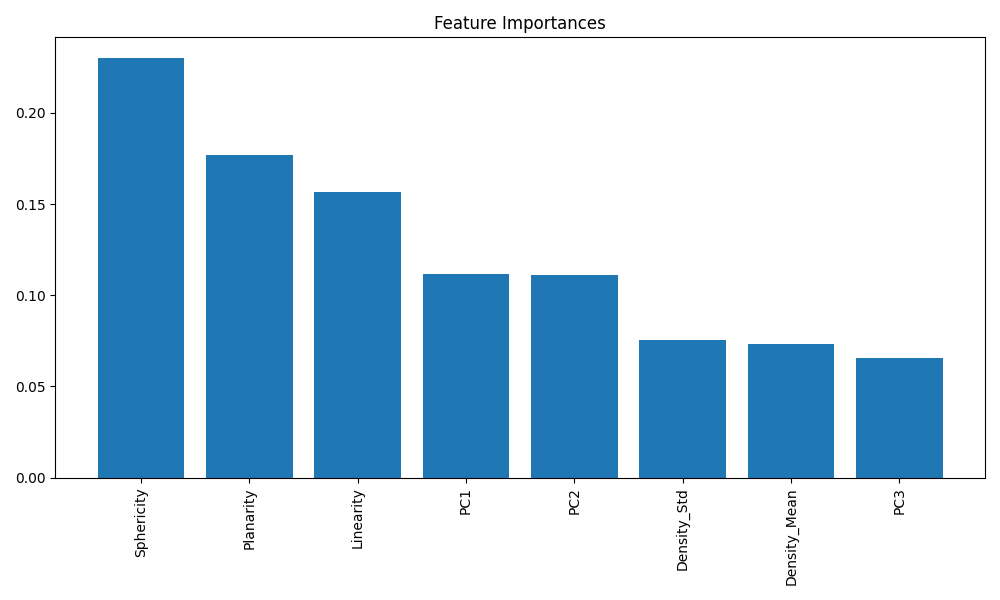
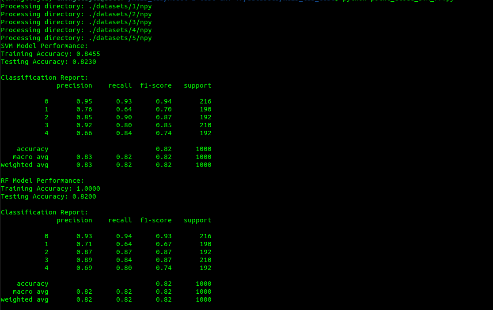

# LiDAR Point Cloud Machine Learning

Research project exploring preprocessing, statistical analysis, geometric feature extraction, and supervised learning on LiDAR point-cloud data.

The project supported experiments on a large LiDAR dataset by standardizing point-cloud inputs, analyzing geometric characteristics, and evaluating machine-learning approaches for point-cloud classification.

## Project Work

Key work included:

- Standardizing 7,000+ LiDAR point clouds from a 30+ GB research dataset
- Analyzing 100,000+ LiDAR points for geometric and statistical characteristics
- Exploring feature representations with statistical analysis and PCA
- Evaluating supervised-learning approaches including SVM and random forests
- Experimenting with PyTorch-based classification workflows
- Producing visualizations to inspect point-cloud and model behavior

## Repository Structure

```text
lidar-point-cloud-ml/
├── datasets/                     # Research datasets; excluded from version control
├── figures/                  # Analysis and experiment figures
├── src/
│   ├── analyze_stats.py
│   ├── classification.py
│   └── point_cloud_svm_rf.py
├── .gitignore
├── README.md
└── requirements.txt
```

## Setup

Create a virtual environment and install the dependencies:

```bash
python -m venv .venv
source .venv/Scripts/activate
python -m pip install -r requirements.txt
```

## Analysis Scripts

Statistical and point-cloud analysis:

```bash
python src/analyze_stats.py
```

SVM and random-forest experiments:

```bash
python src/point_cloud_svm_rf.py
```

Additional classification experiments:

```bash
python src/classification.py
```

## Results







## Data Availability

The original LiDAR research dataset is not included in this repository. Raw and derived point-cloud data remain local and are excluded from version control.

## Status

Archived undergraduate research project maintained for documentation and reproducibility.
